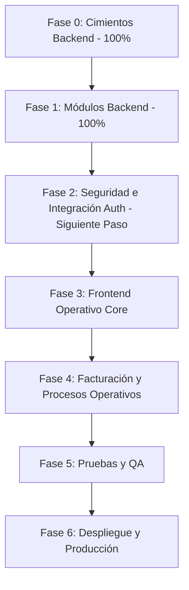

# Plan de Implementación por Fases: Sistema de Parqueadero Residencial

Este documento define la ruta de trabajo y los entregables por cada etapa para culminar con éxito el desarrollo e integración del sistema de parqueadero residencial multi-tenant.

---

## 📊 Estado Actual del Proyecto

El backend se encuentra en una etapa muy madura de desarrollo con lógica modular implementada, mientras que el frontend requiere el desarrollo completo de sus flujos interactivos e integración con los servicios.

* **Backend (NestJS)**: **~85% Completado**. Estructura modular consolidada en [AppModule](file:///home/yoseth/Dev/sistema-parqueadero/backend/src/app.module.ts), 15 migraciones de base de datos ejecutables en PostgreSQL y endpoints expuestos documentados con Swagger.
* **Frontend (Angular 19)**: **~15% Completado**. Configuración de base y layouts en [app.routes.ts](file:///home/yoseth/Dev/sistema-parqueadero/frontend/src/app/app.routes.ts), con el esqueleto de autenticación inicial en [AuthService](file:///home/yoseth/Dev/sistema-parqueadero/frontend/src/core/services/auth.service.ts).

---

## 🗺️ Fases de Implementación

---

### 🟢 Fase 0: Cimientos del Backend y Base de Datos (100% Completado)
* **Descripción**: Configuración inicial de herramientas, estándares de código y base de datos relacional.
* **Entregables**:
  * Estructuración del monorepo.
  * Base de datos PostgreSQL con TypeORM.
  * Configuración de variables de entorno y Swagger global.

### 🟢 Fase 1: Módulos de Lógica de Negocio en Backend (100% Completado)
* **Descripción**: Codificación de servicios, controladores y repositorios para la lógica interna del negocio.
* **Entregables**:
  * Módulos de administración básica (`tenants`, `accounts`, `people`, `roles`).
  * Módulos residenciales (`apartments`, `residents`, `visitors`).
  * Módulos de parqueadero y cobro (`parking`, `billing`).
  * Módulos transaccionales y de soporte (`requests`, `notifications`, `pqrs`).
  * 15 migraciones de base de datos creadas y ejecutables.

### 🟡 Fase 2: Seguridad, RBAC e Integración de Autenticación (Prioridad Alta)
* **Descripción**: Integrar la capa de seguridad y permisos en ambos lados (Backend y Frontend).
* **Acciones Clave**:
  * **Backend**: Fortalecer los guards de autenticación (JWT) y autorización basados en roles (RBAC) con alcances multi-tenant.
  * **Frontend**: Conectar las interfaces de [Login](file:///home/yoseth/Dev/sistema-parqueadero/frontend/src/features/auth/components/login/login.component.ts) y [Register](file:///home/yoseth/Dev/sistema-parqueadero/frontend/src/features/auth/components/register/register.component.ts) con la API REST del backend.
  * **Frontend**: Desarrollar interceptores HTTP para el manejo automático del JWT y guards de rutas para proteger vistas según rol.

### 🔵 Fase 3: Frontend Operativo Core (Parqueadero y Control Residencial)
* **Descripción**: Creación de las interfaces para las operaciones diarias de la administración del parqueadero.
* **Acciones Clave**:
  * **Dashboard**: Panel de control interactivo para administradores del tenant.
  * **Módulo de Parqueadero**: Implementar [PARQUEADERO_ROUTES](file:///home/yoseth/Dev/sistema-parqueadero/frontend/src/features/parqueadero/parqueadero.routes.ts) para visualización de celdas de parqueo (ocupadas, libres, asignadas), control de entrada/salida de vehículos y registro de vehículos.
  * **Módulo Residencial**: Formularios y tablas CRUD de apartamentos, residentes y flujo rápido de Check-in/Check-out de visitantes.

### 🔵 Fase 4: Facturación y Procesos Operativos (Frontend)
* **Descripción**: Interfaz gráfica para transacciones financieras y de comunicación en el conjunto.
* **Acciones Clave**:
  * **Facturación**: Pantallas para configurar tarifas de parqueo (`rates`), visualización de facturas generadas e historial de cobros.
  * **Solicitudes y PQRS**: Pantallas para radicar e interactuar con PQRS y solicitudes de parqueadero.
  * **Notificaciones**: Vista del historial de notificaciones para los residentes.

### 🔵 Fase 5: Pruebas y Aseguramiento de Calidad (QA)
* **Descripción**: Fase de cobertura de pruebas y refinamiento estético de la aplicación.
* **Acciones Clave**:
  * Pruebas unitarias de controladores y servicios críticos en NestJS.
  * Pruebas unitarias y de componentes en Angular.
  * Pruebas de integración E2E.
  * Pulido de experiencia de usuario (micro-animaciones, manejo de estados de carga, alertas y adaptabilidad responsive).

### 🔵 Fase 6: Despliegue y Puesta en Producción
* **Descripción**: Empaquetado y distribución del sistema de forma automatizada y escalable.
* **Acciones Clave**:
  * Dockerización del Backend, Frontend y PostgreSQL (archivos `Dockerfile` y `docker-compose.yml`).
  * Configuración de un pipeline CI/CD (GitHub Actions / GitLab CI).
  * Despliegue en un entorno de pruebas (Staging) y posterior paso a producción.
